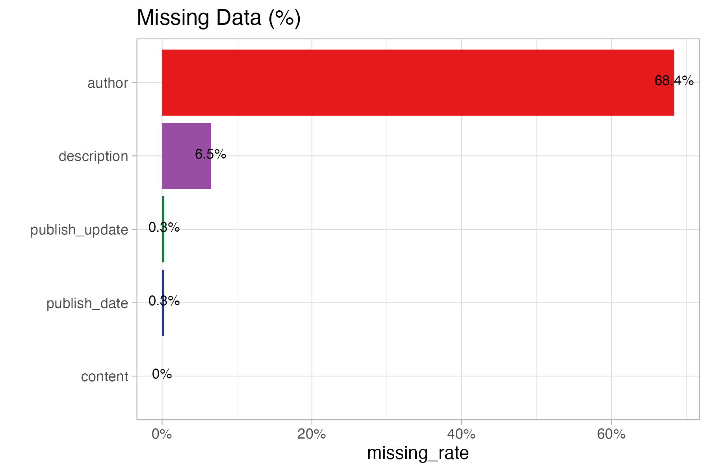
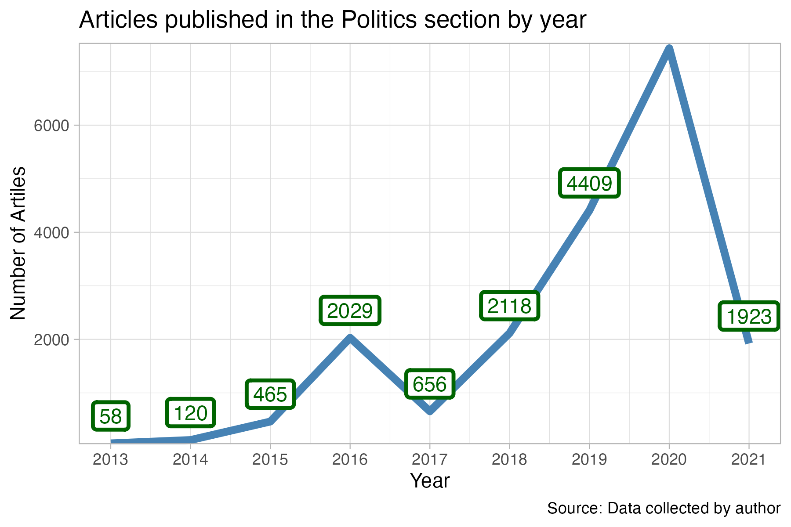
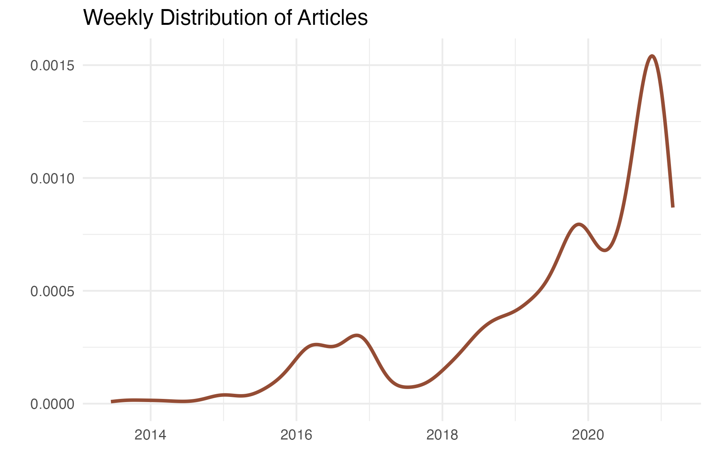

# Epoch Times Political News Analysis

This repo contains all the code for scraping and data analysis used in the published research.  
Read the research [here](https://www.tandfonline.com/doi/abs/10.1080/10646175.2025.2455590).

### 📚 **Cite the research:**  
Nguyen, T. (2025). *Rising Media Enclave Extremism: The Case of the Epoch Times and Ethnic Mobilization on the Far-Right*. *Howard Journal of Communications*, 1–20. [https://doi.org/10.1080/10646175.2025.2455590](https://doi.org/10.1080/10646175.2025.2455590)

The data supporting the findings of this study are openly available at [Harvard Dataverse](https://doi.org/10.7910/DVN/C25J3R).

---

## 📰 **Scraping**

This project scrapes articles from [The Epoch Times Politics section](https://www.theepochtimes.com/c-us-politics), extracts relevant information, and formats it for text analysis.

- The file `scraping_guide_step_by_step.Rmd` provides detailed guidance on reproducing the results.  
- It scrapes articles from the "Politics" section of The Epoch Times published between **2014** and **2022**.

**Tools used:**  
- **R**  
- **Packages:** `rvest`, `xml2`, `httr`

---

## 📊 **Data Description**

Articles published in the Politics section by year

Weekly Distribution of Articles

Frequency of words

## Sentiment analysis

## Exploring main theme

